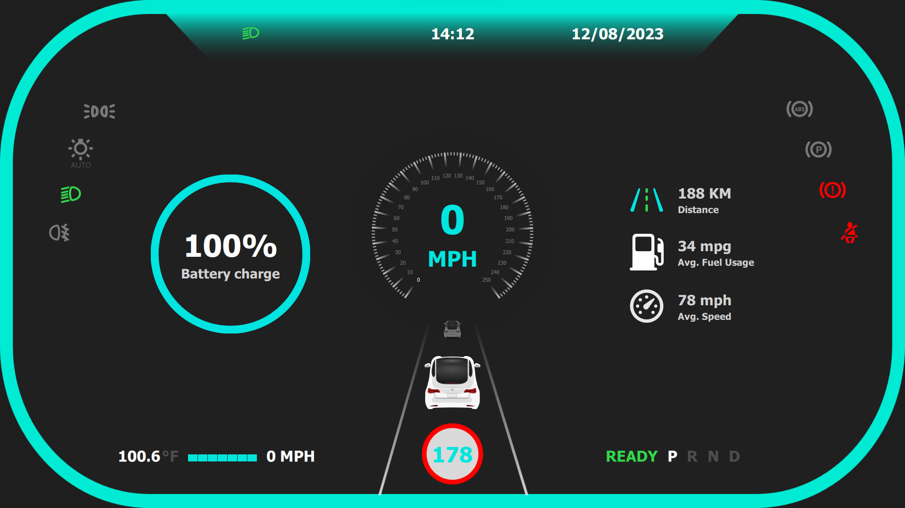

# Car Dashboard using Qt QML

This project is a car dashboard user interface built using Qt QML. It provides a modern and intuitive interface for displaying essential information for a vehicle, such as speed, fuel level, temperature, and more.

## Table of Contents

- [Introduction](#introduction)
- [Features](#features)
- [Screenshots](#screenshots)
- [Video Demo](#video-demo)
- [Prerequisites](#prerequisites)
- [Getting Started](#getting-started)
- [Usage](#usage)
- [Contributing](#contributing)
- [License](#license)
- [Acknowledgments](#acknowledgments)

## Introduction

The Car Dashboard project aims to create a user-friendly dashboard interface for vehicles using Qt QML. It allows users to monitor critical vehicle parameters in real-time, providing a digital representation of the traditional dashboard found in automobiles.

## Features

- **Speedometer**: Displays the current speed of the vehicle in real-time.
- **Fuel Gauge**: Shows the fuel level with a visual gauge.
- **Temperature**: Monitors the temperature inside the vehicle.
- **RPM (Revolution Per Minute)**: Indicates the engine RPM.
- **Odometer**: Tracks the total distance traveled by the vehicle.
- **Engine Status**: Indicates whether the engine is running or not.
- **Turn Signals**: Visual indicators for left and right turn signals.
- **Warning Lights**: Alerts for various vehicle conditions (e.g., low fuel, check engine).
- **Customizable**: The UI is designed to be easily customizable to fit different vehicle types and styles.

## Screenshots



## Video Demo

[](https://www.youtube.com/watch?v=Bf660-_w5zU)

## Prerequisites

Before you begin, ensure you have met the following requirements:

- Qt 5.x or higher installed on your system.
- Basic knowledge of QML (Qt Quick Markup Language).

## Getting Started

To get a local copy up and running, follow these simple steps:

1. Clone the repository:

```bash
git clone git@github.com:cppqtdev/Car-Dashboard-2.git
